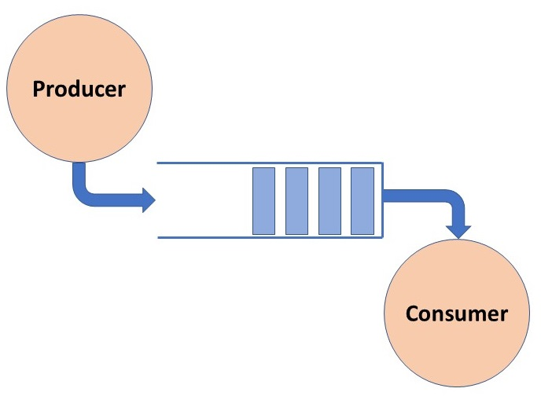

# Exemplos práticos do conceito "Producer and Consumer"
O conceito de Producers and Consumers foi inicialmente pensado e descrito por Edsger W. Dijkstra em 1965.

- No [Exemplo 1](https://github.com/AlldDev/Producer-and-Consumer-Example/tree/main/example-1) demonstro como implementar esse conceito em um unico arquivo. 
- No [Exemplo 2](https://github.com/AlldDev/Producer-and-Consumer-Example/tree/main/example-2) demonstro como implementar esse conceito em 2 arquivos separados.

> [!TIP]
> No Exemplo 2, estamos criando um "Produtor" e um "Consumidor" em arquivos separados. Isso é possível porque o Python atribui valores para novas variáveis apenas quando o tipo de dado é primitivo, como `string`, `int`, `float` e `booleano`. Para todos os outros tipos de dados (exemplo vetores e listas), ele passa apenas um apontador para o espaço de memória no qual a variável está alocada.

O funcionamento em tese é simples, criamos um "Buffer" (vetor) compartilhado que sera acessado tanto pelo producer quanto pelo consumer, junto a esse buffer, utilizamos `threading.Event` e `threading.Lock` para manter a consistencia do buffer (explicarei melhor mais a frente).

## Como descrito por Dijkstra... 
O problema de "Producers and Consumers" é um clássico problema de sincronização em sistemas concorrentes. O problema envolve dois tipos de processos: produtores e consumidores, que compartilham um buffer comum de tamanho fixo.
- Produtores: Geram dados e os colocam no buffer.
- Consumidores: Retiram dados do buffer para processá-los.
O desafio é garantir que os produtores não adicionem dados a um buffer cheio e que os consumidores não tentem retirar dados de um buffer vazio. Além disso, <b>é necessário garantir que múltiplos produtores e consumidores possam operar de maneira concorrente sem corromper os dados no buffer.</b>

Para resolver este problema, são utilizadas técnicas de sincronização, como mutexes (locks) e semáforos (events), para coordenar o acesso ao buffer e evitar condições de corrida (race conditions).

## Em resumo, 
O problema dos "Producers and Consumers" lida com a coordenação e sincronização de múltiplos processos concorrentes que compartilham um recurso comum (o buffer), garantindo que o acesso ao buffer seja seguro e eficiente.

- Nos exemplos, a função producer aciona o `threading.Lock` para ter exclusividade sobre o buffer, garantindo que somente ela possa modificar o buffer naquele momento. Outra função só poderá utilizar o buffer quando o producer terminar e subir o `threading.Event` sinalizando a finalização.

- De modo semelhante, a função consumer só poderá alterar ou remover algo do buffer quando o producer liberar o `threading.Lock`, saberemos disso pelo `threading.Event`.

> [!IMPORTANT]
> Esta é uma explicação extremamente resumida do funcionamento dos códigos demonstrados aqui. Por esse motivo, é importante estudar os códigos detalhadamente e ler mais sobre o assunto para compreender e maximizar seu aprendizado.

> [!NOTE]
> A biblioteca Queue em python faz exatamente isso porém de maneira abstrata, sem a necessidade de setar Events, utilizar Locks ou manipular a estrutura sem causar Dead Thread, porém o intuito aqui é demonstrar a essencia do funcionamento desse conceito tão importante para a computação, principalmente a distribuida!
